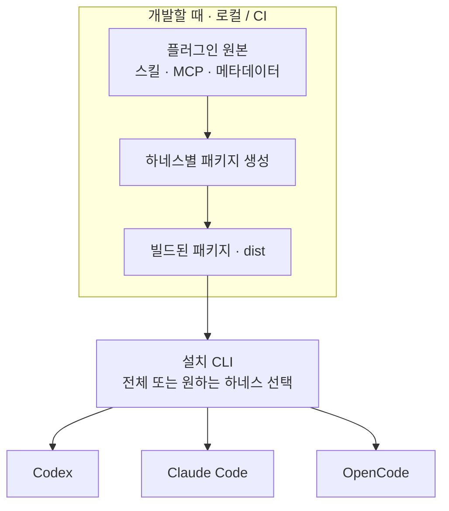
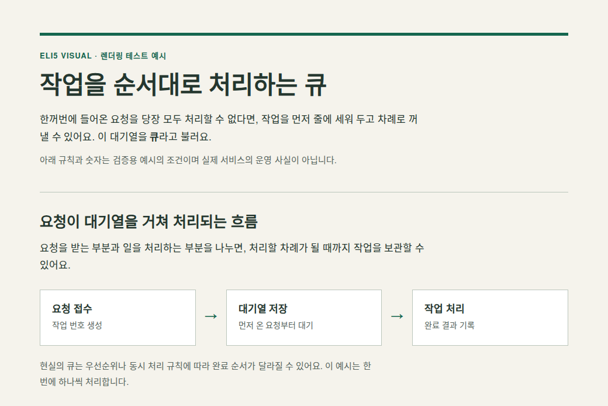

# Agent Plugins

[](https://github.com/atototo/agent-plugins/actions/workflows/check.yml)

**내 플러그인은 한곳에서 관리하고, 설치는 원하는 하네스에 한 번에.**

스킬·MCP·설정을 **플러그인 단위**로 묶는 개인 저장소다.
공통 원본을 Codex · Claude Code · OpenCode 패키지로 만들고, 하나의 CLI로 설치한다.

[전체 구조](#overview) · [설치하기](#install) · [업데이트](#update) · [ELI5 Visual](#eli5-visual) · [검증 상태](#verification) · [개발하기](#development)

> **v0.1 개발판** — 소스와 CI는 공개됐지만 npm에는 아직 게시하지 않았다.
> 자동 테스트·실제 MCP·HTML 렌더링과 Codex 네이티브 설치·로드는 검증했다.
> **세 하네스의 전체 사용 검증은 진행 중**이며, 완료 범위와 제약은 [검증 기록](docs/VALIDATION.md)에 구분했다.

<a id="overview"></a>

## 공통 원본에서 세 하네스로

플러그인 내용은 `plugins/`에 작성한다. 하네스별 파일 형식은 빌드가 만들고,
설치기는 준비된 패키지를 선택한 하네스에 등록한다.



설치 명령은 하나지만, 내부에서는 **각 하네스의 서로 다른 등록 방식**을 사용한다.

| 대상 | 설치기가 연결하는 방식 | 사전 조건 |
| --- | --- | --- |
| Codex | 네이티브 마켓플레이스 + `.codex-plugin` 패키지 | CLI **0.153.4 이상** |
| Claude Code | 네이티브 마켓플레이스 + `.claude-plugin` 패키지 | **2.1.212 이상**, `uninstall --keep-data` 지원 |
| OpenCode | `plugin` 배열에 JS 모듈 등록 → 스킬 경로·MCP 설정 추가 | 유효한 global JSON/JSONC 경로 |

설치 범위는 **user/global**이며 프로젝트 설정은 수정하지 않는다.
OpenCode 실행 파일은 등록 단계의 선행조건이 아니므로, 등록 후 실제 로딩은 별도 확인이 필요하다.

<a id="install"></a>

## 설치하기

### 1. 소스로 준비하기

현재 npm 미게시 상태이므로, 처음에는 저장소에서 설치기를 준비한다. **Node.js 22 이상**이 필요하다.

```bash
git clone https://github.com/atototo/agent-plugins.git
cd agent-plugins
npm ci
npm run check
```

여기까지는 빌드와 검사만 수행한다. **사용자 하네스에는 아직 설치하지 않는다.**
이미 빌드된 tarball이 있다면 이 과정 없이 [패키지로 설치하기](docs/USAGE.md#package-install)를 이용할 수 있다.

### 2. 변경 계획 확인하기

```bash
node bin/agent-plugins.mjs install eli5-visual --harness all --dry-run
```

`--dry-run`은 계획만 출력하고 설정·설치 기록을 만들지 않는다.
하네스 CLI의 실행 가능 여부는 실제 적용 전 사전 검사에서 확인한다.

### 3. 원하는 하네스에 한 번에 설치하기

```bash
# 세 하네스 모두
node bin/agent-plugins.mjs install eli5-visual --harness all --yes

# 또는 Codex와 OpenCode만
node bin/agent-plugins.mjs install eli5-visual --harness codex,opencode --yes
```

대화형 터미널에서는 `--harness`를 생략하고 대상을 선택할 수도 있다.
`--yes`는 변경 적용을 확인하는 옵션이다. 설치 뒤에는 **새 하네스 세션을 시작한다.**

> `install --harness all`은 세 하네스를 명시적으로 선택한다는 뜻이다. Codex/Claude CLI가 없으면
> 하네스 설정 변경 전에 중단하며, 누락된 하네스를 조용히 건너뛰거나 대신 설치하지 않는다.
> 중간 실행 실패는 하네스별로 기록한다. 전체 자동 롤백은 보장하지 않는다.

설치 후 [사용·업데이트·제거 가이드](docs/USAGE.md)를 참고한다.

<a id="update"></a>

## 업데이트도 한 번에

새 소스를 받아 빌드하거나 새 패키지를 준비한 뒤, 플러그인과 하네스를 다시 나열할 필요 없이 실행한다.

```bash
# 기존 설치 대상과 변경 전·후 버전 확인
node bin/agent-plugins.mjs update --dry-run

# 설치 기록에 있는 플러그인·하네스 조합만 갱신
node bin/agent-plugins.mjs update --yes
```

예를 들어 Codex와 OpenCode에만 설치했다면 **두 곳만 업데이트**한다.
`update --harness all`도 미설치 하네스를 추가하지 않는다. 특정 대상만 갱신하려면
`update eli5-visual --harness codex --yes`처럼 필터를 붙인다.
새 하네스에 추가할 때는 `install`을 사용한다.

**GitHub에 올리거나 npm 패키지를 새로 받는 것만으로 기존 플러그인이 바뀌지는 않는다.**
`update`는 실행 중인 패키지에 포함된 번들을 적용하며, 최신 릴리스를 직접 다운로드하지 않는다.
처음 지정한 OpenCode 설정 경로도 설치 기록에서 재사용한다. 적용 뒤 새 세션을 시작한다.
[배포 방식별 업데이트 절차와 버전 규칙](docs/USAGE.md#update)

<a id="eli5-visual"></a>

## 첫 플러그인: ELI5 Visual

**어려운 개념이나 긴 문서를, 중요한 사실을 빠뜨리지 않는 시각 설명으로.**

짧은 질문에는 설명과 다이어그램을, 긴 원문에는 한 장으로 이어지는 스크롤형 HTML 브리프를 만든다.
쉬운 말로 바꾸되 현재 상태·제약·숫자·조건·다음 결정을 지우지 않는 것이 핵심이다.

> “이 설계 문서를 처음 보는 사람에게 중요한 제약과 다음 할 일까지
> 빠뜨리지 않는 스크롤형 시각 설명으로 만들어줘.”



*실제 Chromium으로 렌더링한 [고정 테스트용 HTML](test/fixtures/visual-brief.html)의 상단이다.
전체 예시에는 작업 레코드와 재시도 조건도 이어진다. 에이전트가 자동 생성한 결과나 품질 보장 사례로 제시하는 이미지는 아니다.*

| 구성 요소 | 맡는 일 |
| --- | --- |
| `eli5-visual` 스킬 | 보존할 사실 선정, 초보자용 설명 구성, 시각적 이야기 순서 결정 |
| 외부 `visual-explainer@0.11.0` MCP | 에이전트가 작성한 HTML을 로컬 파일로 저장 |
| 사용 가능한 브라우저 | **저장한 HTML 자체**를 열어 글자 잘림·배치·가독성 확인 |

자체 시각화 MCP를 새로 만들지 않으며 **Playwright MCP도 필수 의존성이 아니다.**
하네스에 사용 가능한 브라우저 수단을 우선 이용한다. 브라우저가 없으면 HTML은 전달하되,
화면 검증을 하지 못했다고 명시한다. 이 저장소의 Playwright 라이브러리는 개발·CI 검사용이다.

기본 결과물은 **편집 가능한 독립 HTML + 파일 참조**다. 실제 live Visualize 기능이 있는 환경에서만
그 환경의 계약에 따라 인라인 출력을 사용한다. 일반 MCP 연결만으로 채팅 안에 HTML이 표시된다고 가정하지 않는다.

<a id="verification"></a>

## 어디까지 검증했나

CI 초록 배지는 빌드·테스트 결과를 나타낸다. 실제 하네스에서 스킬을 찾고 사용하는 전체 경험과는 구분한다.

| 검사 | 현재 확인한 범위 |
| --- | --- |
| 자동 테스트 | 중복 설치, 설정 보존, 설치 조합을 유지하는 업데이트·필터, 부분 실패·재시도, 제거·경로 보호 |
| 실제 외부 MCP 실행 | 연결, 도구·리소스 조회, full/quick HTML 저장, 경로 이탈 차단 |
| 실제 Codex CLI 0.153.4 | 네이티브 설치·스킬 발견·MCP 호출·업데이트·제거. 모델 생성과 검증 차단은 [별도 기록](docs/VALIDATION.md) |
| 실제 Chromium 렌더링 | 고정 예시의 **1200px / 390px** 레이아웃·넘침·페이지 오류 검사, 로컬 캡처 시각 검수 |
| GitHub Actions | **Node 22·24**에서 자동 검사와 tarball 생성. [실행 결과](https://github.com/atototo/agent-plugins/actions/workflows/check.yml) |
| **남은 검증** | Claude/OpenCode 실제 설치·사용·업데이트·제거, Codex의 다양한 원문·브라우저 가용성 조건에서 전체 사용 검증 |

`doctor`는 파일 해시와 등록 상태를 확인한다. MCP 연결 성공, 브라우저 가용성,
원문 내용 보존이나 설명 품질까지 보증하지 않는다. [검증 방법과 한계](docs/VALIDATION.md)

### 설치기가 보존하는 것

- 기존 설정·주석과 관리하지 않는 플러그인을 덮어쓰지 않는다.
- 제거해도 **HTML 결과물·패키지 스냅샷·네이티브 마켓플레이스 등록**은 남긴다.
- 브라우저 설치, 계정 로그인, 권한 변경, 결과 공개를 자동 수행하지 않는다.

MCP는 로컬 프로세스지만, 에이전트가 읽는 자료는 선택한 모델 제공자에게 전달될 수 있다.
“로컬 MCP”가 전체 작업의 오프라인 실행을 뜻하지는 않는다.

<a id="development"></a>

## 플러그인 개발하기

```text
agent-plugins/
├── catalog.json             플러그인 목록
├── plugins/                 직접 작성하는 공통 원본
│   └── eli5-visual/
│       ├── plugin.json      패키지 정의
│       └── skills/          편집·렌더링·검증 지침
├── renderers/               Codex / Claude / OpenCode 형식 생성
├── runtime/                 번들된 외부 MCP 실행 래퍼
├── bin/ + src/              단일 설치 CLI와 설정·상태 관리
├── scripts/ + test/         빌드 및 격리된 검증
└── dist/                    생성된 패키지 — Git에서 제외
```

| 하고 싶은 일 | 실행할 명령 |
| --- | --- |
| 빌드 + 무결성·설치기·MCP 검사 | `npm run check` |
| 최종 HTML의 브라우저 검사 | `npm run test:browser` |
| 검증 후 배포용 `.tgz` 만들기 | `npm run pack:local` |

브라우저 검사는 Chromium·시스템 라이브러리·한글 폰트 준비가 필요하다.
새 환경에서는 [브라우저 검증 준비](docs/USAGE.md#browser-check)를 먼저 확인한다.

**패키지 렌더러는 개발자의 로컬 빌드와 CI에서 실행한다.**
플러그인을 사용할 때마다 패키지를 다시 만들지 않는다. 설명용 HTML을 만들고 렌더링하는 작업은 별개다.

새 플러그인은 `plugins/<name>`에 원본을 만들고 `catalog.json`에 추가한다.
v0.1 범위는 **스킬 + 지원되는 로컬 MCP**다. 새 MCP 제공자는 별도 어댑터와 검증이 필요하다.
훅·에이전트·LSP의 범용 변환, 프로젝트 범위 설치, Windows 네이티브 명령 실행은 아직 지원 범위가 아니다.

## 배포 상태와 더 읽을 문서

- GitHub 소스와 CI 산출물은 제공하지만, **npm 게시와 자동 릴리스는 아직 하지 않는다.**
- 소스 저장소 루트는 네이티브 마켓플레이스가 아니다. 생성된 `dist/codex`, `dist/claude`가 각각의 루트다.
- npm 이름은 아직 작업용 `personal-agent-plugins`이고 `private: true`를 유지한다.
- 공개 라이선스는 미정이다. 자체 코드는 현재 `UNLICENSED`이며, 외부 코드의 라이선스는 별도로 유지한다.

| 문서 | 궁금한 내용 |
| --- | --- |
| [사용 가이드](docs/USAGE.md) | tarball 설치, 사용 명령, 설정 경로, 업데이트·제거, 실패 복구 |
| [전체 설계](docs/DESIGN.md) | 하네스별 책임, 두 종류의 렌더링, 설치 상태·소유권, 확장 경계 |
| [조사 근거](docs/RESEARCH.md) | 구현에 참고한 공식 문서와 upstream 소스 |
| [검증 범위](docs/VALIDATION.md) | 테스트가 증명하는 것과 남은 실제 사용 검증 |
| [외부 코드 고지](THIRD_PARTY_NOTICES.md) | 번들된 MCP와 의존성의 라이선스 안내 |
